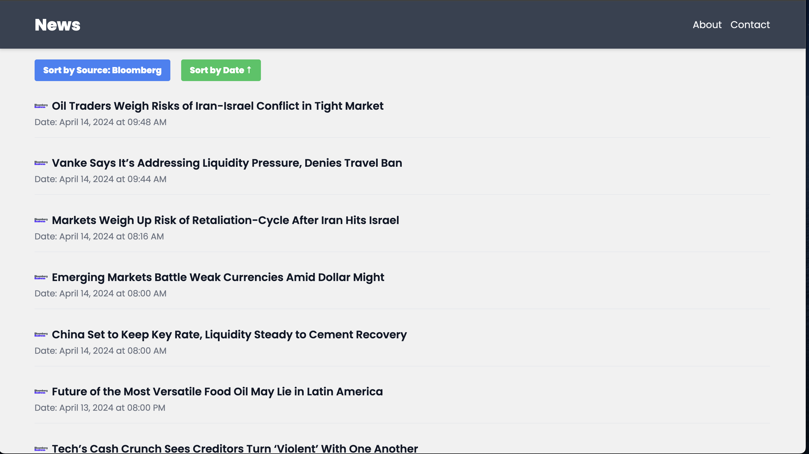

# News Aggregator Web Application

## Introduction

This project is a News Aggregator Web Application that provides up-to-date news articles from various sources. It utilizes a MERN stack (MongoDB, Express.js, React, and Node.js) for the backend and features Python web scrapers to scrape news data from individual websites.

## Features

- **Real-time News Updates:** Aggregates news from multiple sources and displays them in real-time.
- **Interactive UI:** Users can sort news by date or source using interactive buttons.
- **Responsive Design:** Tailored to provide an optimal viewing experience across a range of devices.

## Technologies Used

- **Frontend:**
  - React.js
  - Tailwind CSS
- **Backend:**
  - Node.js
  - Express.js
  - MongoDB
- **Data Scraping:**
  - Python
  - Libraries: BeautifulSoup, Requests

## Project Structure

/news-aggregator-app  
|-- /backend  
| |-- /models  
| |-- /routes  
| |-- server.js  
|-- /frontend  
| |-- /src  
| | |-- /components  
| | |-- /App.js  
| | |-- /index.js  
|-- /scrapers  
| |-- scraper.py  
|-- README.md

## Setup and Installation

### Prerequisites

- Node.js
- MongoDB
- Python 3.x

### Getting Started

Clone the repository:

```bash
git clone https://github.com/lukewaehner/BussingBews.git
cd BussingNews
```

## Backend Setup

### Install Backend and Run the Server

cd backend  
npm install  
npm run dev

## Frontend Setup

### Install Frontend and Run the Application

cd ../frontend  
npm install  
npm start

The application should now be running on http://localhost:3000.

### Setting up the Python Scrapers

Install the required Python libraries:

```bash
cd ../scrapers
pip install -r requirements.txt
python scraper.py
```

## Running the application

You will have to add your own MognoDB Atlas connection string to a .env file placed in the backend directory.  
The .env file should look like this:

```bash
MONGO_URI=mongodb+srv://<username>:<password>@newscluster.aemxbgw.mongodb.net/<DataBaseName>?retryWrites=true&w=majority&appName=<ClusterName>
```

This can all be found using Atlas' connection feature.

```bash
 cd /backend/
 python3 main.py
 npm run dev
```

Run a new terminal instance and continue with:

```bash
    cd /frontend/
    npm start
```

## Screenshots

### Home Page


